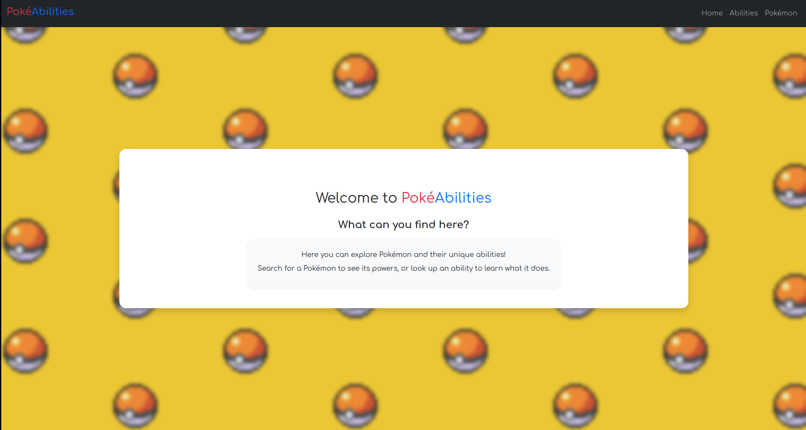
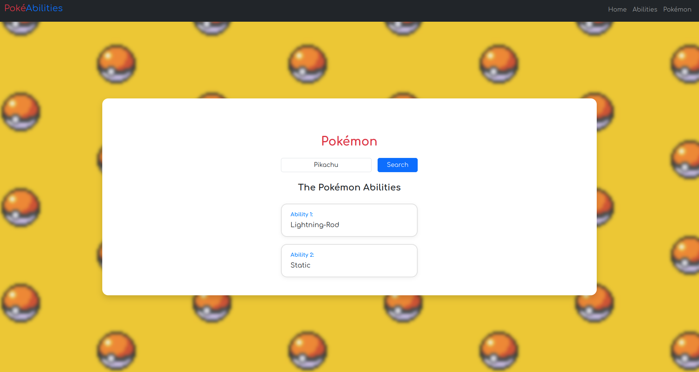
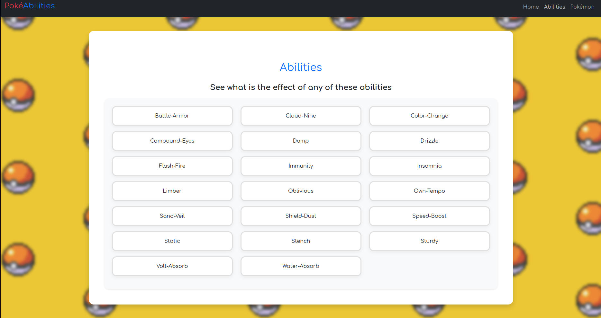

# PokeAbility - ZRP Interview  

## Overview 
This is the phase 3 project of ZRP interview. 

## API 
The project provide a backend server that communicates with the pokeAPI
[ Visit the pokeapi website: https://pokeapi.co/about ]  and got two main 
endpoints: 

* `/api/pokemon/poke-abilities/:pokeName`
* `/api/pokemon/abilities-description/:abilityName`

## poke-abilities

The first one, provides the name abilities of the given pokemon. 
The abilities are given lexicographical sorted  

#### Example
Using the curl tool who can access the endpoint and get the abilities name of the pikachu using: 

    curl -X GET "http://localhost:3000/api/pokemon/poke-abilities/pikachu"
    > ["lightning-rod","static"]

#### Note
Invalid pokemons name return 404 status with an empty array, so: 

    curl -X GET "http://localhost:3000/api/pokemon/poke-abilities/unknown-pokemon"
    > []

## abilities-description 
The second one, provides some useful information about the given ability. This endpoint 
return a JSON with *effect* and *short_effect* properties, that have some english text explain the effects of 
using this given ability. 

#### Example 
Using curl again we got:
    
    curl -X GET "http://localhost:3000/api/pokemon/abilities-description/blaze"
    > {
        "effect":"When this Pokémon has 1/3 or less of its HP remaining, its fire-type moves inflict 1.5× as much regular damage.",
        "short_effect":"Strengthens fire moves to inflict 1.5× damage at 1/3 max HP or less."
    }

#### Note 
Invalid abilities name return 404 status with and "Not Found" in both fields, so:
    
    curl -X GET "http://localhost:3000/api/pokemon/abilities-description/unknowm-ability"
    > {"effect":"Not Found","short_effect":"Not Found"

## Interface 
You can also access this API using the frontend interface

The home page should look like this: 

### Pokemon 
You can get all the pokemon's ability by filling the form in the pokemon page: 

You can click in an ability to see the effects:

### Ability 
You can also see all abilities in the abilities page. You might click a ability to see the effects

